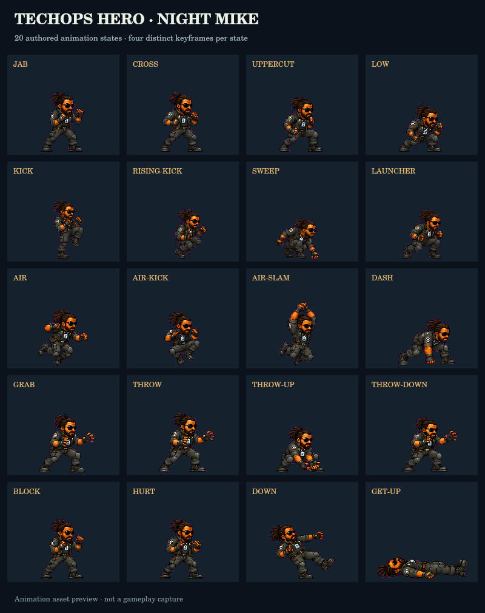

# Visual and movement-combat integration

This change integrates all five environment concepts from the September 12 live
QA, four property props, and Mike's full 20-state street-combat animation set.
It also makes dash/grab a movement combo and keeps launched targets within reach
of an explicitly requested jump and three-hit aerial chain.

The integration starts from main `61f5fef`. Visual authority remains
[`VISUAL_REFERENCE_STANDARD.md`](../VISUAL_REFERENCE_STANDARD.md),
[`CINEMATIC_COHESION_V1.md`](../CINEMATIC_COHESION_V1.md), and the approved handoff
identities. Mike retains his Black, bearded, tied-dreadlocks, sunglasses, black
technical outfit and ID-badge identity. Kat and Man retain their approved atlases.
The domestic Waldo renderer remains civilian; the masked prison Waldo atlas is
not substituted into his property.

## Scene-to-evidence map

All source captures below are **unaltered live browser screenshots from September
12**, before this integration. Their deployment commit was not verified. The
subset manifest preserves the original scene labels, observations and SHA-256
hashes. The new WebP files are generated production art derived from those
captures and their concept overpaints; they are not screenshots of the running
branch. Baked actors and HUD from the concepts were removed during authoring.

| Scene and original evidence | New runtime asset | Responsible layer / code | Visual change |
|---|---|---|---|
| Industrial District — [QA-011](visual-combat/qa-011.jpg) | [industrial.webp](../assets/visual-combat/industrial.webp) | `runtime_scene_art.js`; `night_hooks.js:drawNM` | Authored warehouse depth, warm practical lights, textured foreground and supported collision platforms. |
| Long Wharf — [QA-015](visual-combat/qa-015.jpg) | [longwharf.webp](../assets/visual-combat/longwharf.webp) | `runtime_scene_art.js`; `night_hooks.js:drawNM` | Outdoor waterfront geography and wet dock lighting replace the previously observed indoor-world mismatch; no painted foreground people. |
| Good Dogs home / M1 — [QA-017](visual-combat/qa-017.jpg) | [gooddogs-home.webp](../assets/visual-combat/gooddogs-home.webp) | `good_dogs_home_scene.js`; `runtime_scene_art.js`; `night_hooks.js` | Shared house art in the first two prologue shots and gameplay; detailed yard ground; original garage/false-wall owner blends in over camera x=280–660. |
| Waldo's Place — [QA-025](visual-combat/qa-025.jpg) | [waldo.webp](../assets/visual-combat/waldo.webp); [waldo-props.png](../assets/visual-combat/waldo-props.png) | `runtime_scene_art.js`; `v733_hooks.js` | Continuous 1,800-unit property panorama, porch/garage aligned with existing hotspots, authored mower/grill/dish/chest, readable civilian Waldo scale. |
| Home Street — [QA-027](visual-combat/qa-027.jpg) | [home.webp](../assets/visual-combat/home.webp) | `runtime_scene_art.js`; `runtime_night.js:drawHome` | Continuous residential panorama with the authored APT 4B entrance anchored to `HOME_X=1560`; warm windows, wet street and foreground fence. |

`assets/visual-combat/scene-sources.json` records encoded asset hashes, source-image
hashes, original capture hashes, dimensions and ground registration. Collision
coordinates, doors and mission progression are unchanged. Art is drawn in the
existing background/ground/platform slots before live actors. A layer returns
false until its image has decoded so the existing fallback remains usable.

Home and Waldo use one continuous image on the interaction plane; background and
ground share horizontal scale and camera offset. They do not assemble facades
from pasted rectangular fragments. Industrial and Wharf retain slower backdrop
parallax while platform fascia/supports and the floor use world coordinates.

## Priorities addressed

| Priority | Audit finding / risk | Change and acceptance boundary |
|---|---|---|
| P0 | F01: Day UI leaked into Night travel/gameplay in the original captures. | Preserve main's mode-scoped HUD and dialog cleanup. This branch retains the existing mobile/lifecycle checks; it does not claim a new full live HUD crawl. |
| P1 | F02/F07: flat fill, unsupported debug slabs, wrong-world Long Wharf art. | Bind the five authored environments at their actual layer owners; dress existing platforms before actors and skip duplicate late dressing. |
| P1 | F04: Mike/car/NPC scale mismatch; static scale wrapper suppressing move art. | Put the 70–82 px Mike scale in the stable renderer for idle/run/jump/combat, keep a 228 px minimum Charger body width, and scale domestic Waldo to approximately 74 px. |
| P1 | F06: house-to-gameplay cohesion and procedural property. | Shared M1 house source, retained garage handoff, continuous property geography and four authored interactive props. |
| P1 | Combat readability and out-of-reach throws. | Distinct authored poses timed to real contact/recovery; shorter side/up trajectories, explicit jump-cancel, bounded follow drift and a finite air-hit cap. |
| P2 | F05: excessive persistent combat controls and feedback panels. | Hide GRAB/DASH behind MORE by default; show timing feedback only during a relevant combat state. Preserve E/PUNCH context interactions and optional direct controls. |

The original audit was incomplete. Hidden Bay, cockpit/flight/crash, orbital
prison, Cell 118, Sector 04, bosses, Earthfall and late-game content have no new
live-capture acceptance from this work. Their existing cinematic, character and
progression owners remain in place. Integrating these five concepts does not
close the audit's remaining coverage gaps or all Day-mode visual findings.

## Movement controls

| Intent | Primary input | Rule |
|---|---|---|
| Dash left/right | Double-tap A/D or arrows; double-flick the joystick; double-click the direction control | Same direction, distinct input edges, at most 260 ms apart. Held keys and stick threshold jitter do not repeatedly dash. |
| Dash into grab | Punch or kick after dash | Within 340 ms, grounded target within 58 units and feet within 18 units. The window is consumed once; a missed grab becomes the normal attack. |
| High/low attacks after dash | Up/down + punch/kick | Explicit vertical aim takes precedence over contextual grab. |
| Throw | During a hold, change direction or confirm with punch/kick/grab | Left/right throws, up launches, down slams. Existing 120 ms confirmation buffer and 1.6 s hold timeout remain. |
| Follow a launch | JUMP / Space | Connected launch or side/up throw can cancel into a requested jump. Follow drift yields immediately to left/right input. |
| Air combo | Punch / kick while airborne | Three follow-up contacts maximum, then forced descent; down-air kick ends early. No auto-hop or reset of the air-hit budget. |
| Direct alternatives | G / Shift; controller LB / X; MORE → GRAB / DASH | Retained for accessibility and established controller bindings. |

Side throws now launch at horizontal speed 2.8 and vertical speed -8.8; up throws
use 0.9 and -9.8. These are the existing simulation's units. Target follow is
limited to 800 ms, 160 horizontal / 155 vertical units and speed 3.4; input owns
movement. A held body is placed on the selected release side, then normal physics
takes over. Free enemies are never pulled into a grab or teleported into range.
Three air contacts force descent and landing recovery prevents immediate loops.

The movement adapter applies to ordinary Night street combat. Good Dogs, Sector
04 and Waldo's social property retain their established input/combat owners.

## Authored animation coverage



Every row below has four separately authored source poses. The checked-in atlas
contains 80 cells at 176 × 144, with shared foot pivots and 96 px reference standing
height. The runtime samples the phases relevant to the live action: throws enter
at release after grab preparation, and held guard/grab poses stop before their
release frame. The GIF cycles all source poses for asset review; it does not
represent the runtime's variable timing.

| State | Trigger / meaning | Source sheet |
|---|---|---|
| `jab` | First neutral punch | `source/punch.webp` |
| `cross` | Paced second neutral punch | `source/punch.webp` |
| `uppercut` | Up + punch | `source/punch.webp` |
| `low` | Down + punch | `source/punch.webp` |
| `kick` | Neutral/horizontal kick | `source/kick.webp` |
| `rising-kick` | Up + kick | `source/kick.webp` |
| `sweep` | Down + kick | `source/kick.webp` |
| `launcher` | Connected neutral-chain finisher | `source/kick.webp` |
| `air` | Air punch | `source/air.webp` |
| `air-kick` | Air kick | `source/air.webp` |
| `air-slam` | Down + air kick | `source/air.webp` |
| `dash` | Active directional dash | `source/air.webp` |
| `grab` | Close hold | `source/grapple.webp` |
| `throw` | Side release | `source/grapple.webp` |
| `throw-up` | Upward release | `source/grapple.webp` |
| `throw-down` | Downward slam | `source/grapple.webp` |
| `block` | Held guard | `source/defence.webp` |
| `hurt` | Incoming-hit stun | `source/defence.webp` |
| `down` | Defeat / existing down state | `source/defence.webp` |
| `get-up` | Recovery after the down state ends | `source/defence.webp` |

`night_move_visuals.js` consumes `night_combat.js`'s paused simulation clock. Strike
contact poses start at each move's actual windup threshold; facing is locked to
the attack. No new damage timer, listener, simulation loop or renderer wrapper is
introduced. Approved handoff idle/run/jump art remains available and the older
182-frame `MIKE_ACTIONS` candidate stays quarantined.

## Reproduction and validation

Run from the repository root:

```sh
node scripts/production_release_gate.js
node --test test_runtime_triage.mjs
node test_live_crawl_visual_cohesion.js
```

The focused additions are `test_night_movement_combos.js` and
`test_visual_combat_assets.js`, both in the aggregate release gate. The movement
test runs the actual extracted `stepNM` function with the combat/input services.
It checks input edges and mode boundaries, then 54 side/up throw sequences across
16/33/100 ms render intervals, both target heights, both sides and delayed jump
inputs. All three air contacts connect and land; maximum observed horizontal
separation is 58.4 world units. No external repositioning occurs after encounter
setup. The asset test checks state coverage, contact phases, hashes, provenance,
decode fallback, panorama/hotspot registration, viewport coverage and passive
presentation ownership.

Local September 13 results: all 74 aggregate suites and the existing action-atlas
quarantine passed; all 31 runtime-triage tests passed; the live-crawl visual
contract passed. The focused movement suite passed 12 input/scope checks and all
54 air sequences. The five plates and two runtime atlases total 2,909,227 encoded
bytes; checked-in authoring sources are excluded from preload.

Offline composition review used the actual scene-layer functions and approved
actors at camera start/end. It caught and corrected visible facade seams before
integration. These fixtures are explicitly labeled **not gameplay captures**.
To rebuild the review with authoring dependencies `sharp` and `@napi-rs/canvas`
available:

```sh
node scripts/build_visual_combat.cjs
node scripts/render_visual_combat_review.cjs /tmp/techops-visual-review
```

The first command deterministically rebuilds the sprite/prop atlases from checked-in
lossless source WebPs. Passing a directory of the original ImageGen PNGs also
re-encodes the five production scene plates and source manifests. Normal gameplay
and CI use the checked-in assets; authoring dependencies are not runtime imports.
Only the two atlases and five compressed plates are preloaded; source sheets and
review media are not.

The local full-page browser preview was blocked by the browser's access policy.
Consequently this document claims source/physics/asset validation, not full-page
or physical-device visual acceptance. The existing PR Merge Gate and Night combat
workflows run the full game in Chromium/WebKit and upload screenshots/traces. The
combat bot retains its standing-grab/throw/air-combo checks through MORE and adds
a trusted double-tap → dash → attack-grab sequence. CI results belong to the
specific tested commit and must be checked before merge.
